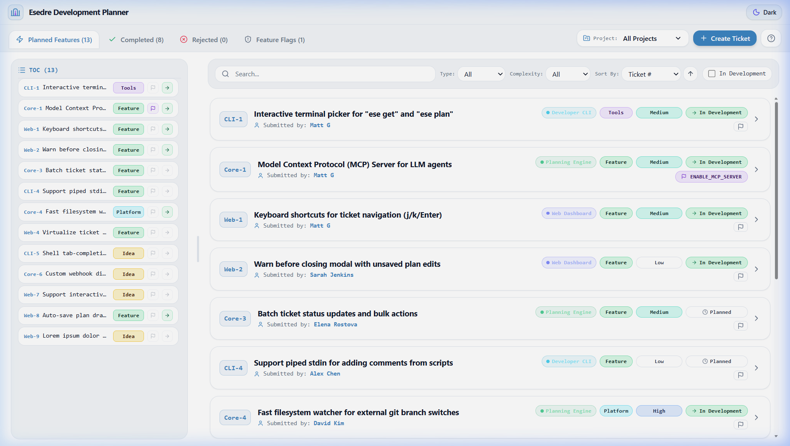
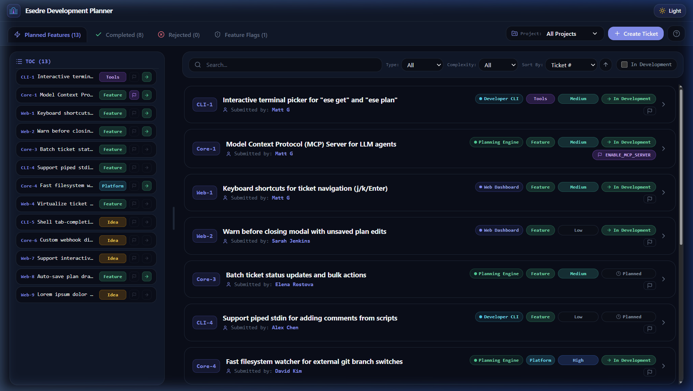

# 🏛️ Esedre (`/eh-ˈseh-dreh/`)

<p align="center">
  
</p>

> **The open developer roadmap and ticketing engine engineered to provide long-term grounding for LLM agent context, powered by a fast CLI, local Web UI, and Model Context Protocol (MCP) server.**

[](LICENSE)
[](tests/)
[](https://www.arwam.com)

---

## 🌟 Overview

**Esedre** (with short CLI alias **`ese`**) is an open-source developer planning engine backed by plain text files (Markdown & JSON) that are easily version-controlled in git. Designed from the ground up for software engineers and autonomous companion LLM coding agents (such as Google Antigravity, Claude Code, and Cursor) to coordinate together, Esedre solves the single biggest bottleneck in LLM-assisted development: **agent context drift and session amnesia**.

<p align="center">
  
</p>

### ⚓ Core Pillar: Long-Term Grounding for LLM Agent Context

LLM coding agents possess extraordinary implementation speed, but face a fundamental architectural ceiling: **context windows fill up, compact, and reset between turns and sessions**. External issue trackers live in distant web silos that agents cannot inspect reliably or locally without API keys and network overhead. Over multi-turn pair programming sessions, models lose track of architectural intent, past verification history, and upcoming milestones.

**Esedre's core feature is providing persistent, authoritative long-term grounding to LLM agent context:**

* **Git-Backed Ground Truth**: Tickets, feature breakdowns, architecture plans, and verification comments reside right alongside source code in git. They branch, merge, and stay synchronized with the codebase.
* **First-Class MCP Integration**: Through the official Model Context Protocol, companion LLMs query roadmap priorities (`esedre_list_tickets`), inspect deep specifications (`esedre_get_ticket`), and update plans (`esedre_save_plan`) in real time.
* **Cross-Session Memory & Grounding**: When an LLM agent begins a new turn, recovers from a context compaction, or transitions across developer handoffs, Esedre grounds the model to concrete technical specifications, constraints, and upcoming milestones: preventing drift and hallucinated direction.
* **Optimistic Concurrency Protection**: Multi-agent pair-programming remains safe through SHA-1 content hash versioning, ensuring concurrent agents or developers never silently overwrite each other's work.

### ⚡ Key Capabilities

1. **Long-Term LLM Agent Grounding**: The primary architectural foundation: anchoring companion LLM agents to persistent project memory, architectural plans, and git-backed roadmap milestones across multi-turn sessions and context compactions.
2. **CLI Commands (`esedre` / `ese`)**: List, query, plan, create, and update tickets via simple terminal commands with human-readable colored tables or machine-readable `--json` output.
3. **Model Context Protocol (MCP) Server**: Full JSON-RPC 2.0 stdio server implementing the official MCP specification (`2024-11-05`), exposing roadmap tickets as first-class tools and URI resources.
4. **Agent Project Allow-List (Multi-Project Isolation)**: Informs each companion LLM only of the projects it is authorized to access, keeping unrelated project tickets, specifications, and plans completely isolated.
5. **Optimistic Concurrency Control**: SHA-1 content hashing on all tickets and plans, preventing concurrent agents or humans from clobbering each other's edits.
6. **Local Web Dashboard & Embeddable Component**: Run a visual dashboard with `esedre serve` to manage tickets in your browser, or embed `<esedre-planner>` into any web app without adding UI framework dependencies to your project.

---

## 🏛️ About the Name

### Origin

**Esedre** derives from classical Latin *exedra* (plural *esedre*), the semicircular architectural council pavilions where ancient architects, master builders, and planners gathered to debate designs, draft blueprints, and coordinate construction. That classical forum mirrors Esedre's mission: a structured, open workspace where developers and companion LLMs collaborate to scope work, align on plans, and ship software.

### Pronunciation Guide

Esedre is pronounced **`eh-SEH-dreh`** (phonetically: **`/ɛˈsɛ.drɛ/`**).

* Short CLI alias: **`ese`** (pronounced **`/ˈɛ.sɛ/`**).

---

## 🚀 Quick Start

### 1. Installation

```bash
# Global CLI installation
npm install -g esedre

# Or run instantly without installation via npx
npx esedre list
npx ese list
```

### 2. Configure Your Project (`.esedre/esedre.json`)

Create an `.esedre/esedre.json` (or root `esedre.json`) configuration:

```json
{
  "projectCode": "MYAPP",
  "allowedProjects": ["MYAPP"]
}
```

> **Tip**: Passing `"allowedProjects": ["*"]` authorizes access to all registered projects in the workspace.

---

## 💻 CLI Commands

Both `esedre` and `ese` can be used interchangeably:

| Command | Usage | Description |
|---|---|---|
| `list` | `ese list [--project <code\|all>] [--status <status>] [--json]` | List roadmap tickets. Defaults to the active project. |
| `get` | `ese get <id> [--json]` | View ticket specifications, feature breakdown, comments, and SHA-1 hash. |
| `plan` | `ese plan <id> [--set "<markdown>"] [--file <path>] [--last-hash <h>]` | Read or update the active implementation plan markdown. |
| `create` | `ese create --title "..." [--project <code>] [--category <cat>]` | Create a new ticket with auto-sequential ID. Title strictly capped at 48 chars. |
| `update` | `ese update <id> [--status <status>] [--title "..."] [--last-hash <h>]` | Update ticket status or title with optimistic concurrency protection. |
| `comment` | `ese comment <id> --text "..." [--author "..."]` | Append a developer or companion agent note to a ticket. |
| `configure` | `ese configure [--project <code>] [--port <n>]` | Initialize workspace configuration, MCP config, and in-repo shell wrappers. |
| `snapshot` | `ese snapshot [--json]` | Generate lean projection `.esedre/snapshot.json` for zero-latency agent context. |
| `projects` | `ese projects [--json]` | List registered projects within authorized scope. |
| `serve` | `ese serve [--port <n>]` | Start the reverse proxy gateway (default 5674) with internal UI & API. |
| `mcp` | `ese mcp` | Launch the Model Context Protocol stdio server for companion LLMs. |

---

## 🤖 Model Context Protocol (MCP) Setup

To connect Esedre to **Google Antigravity**, **Claude Code**, **Cursor**, or any MCP-compatible companion LLM:

```json
{
  "mcpServers": {
    "esedre": {
      "command": "esedre",
      "args": ["mcp"]
    }
  }
}
```

### Registered Tools
- `esedre_list_tickets`: List tickets with optional project, status, category, or search filter.
- `esedre_get_ticket`: Retrieve full specification, summary, comments, revision, and content hash (`sha1`).
- `esedre_get_plan` & `esedre_save_plan`: Inspect and update implementation plans with optimistic concurrency (`lastHash`).
- `esedre_create_ticket`: Mint new roadmap tickets with project code validation (up to 6 chars).
- `esedre_update_ticket`: Modify status, title, complexity, or effort with optimistic concurrency (`lastHash`).
- `esedre_add_comment`: Append developer or companion agent verification notes.

### Resources
- URI Scheme: `esedre://tickets/{id}` (MIME type: `text/markdown`)

---

## 🎨 Embeddable Component & Theming

Esedre includes a drop-in Web Component (`<esedre-planner>`) that allows you to embed the visual developer planner directly into any host web application (React, Vue, Svelte, or vanilla HTML) without adding UI framework dependencies to your project.

### Component Usage

```html
<!-- Load the Esedre embed script -->
<script type="module" src="node_modules/esedre/dist/web/embed.js"></script>

<!-- Embed the planner -->
<esedre-planner
  project="MYAPP"
  api-url="/esedre"
  show-header="false">
</esedre-planner>
```

### Component Attributes

| Attribute | Default | Description |
|---|---|---|
| `project` | `"all"` | Filter tickets to a specific project code (e.g. `Profe`, `Alce`) or `"all"` |
| `api-url` | `"/api/planning"` | Base URL of the Esedre server or reverse proxy endpoint |
| `show-header` | `"true"` | Set to `"false"` to hide the top navigation header for seamless dialog/drawer embedding |
| `read-only` | `"false"` | Disable ticket creation, editing, and plan modification |

### Theming with CSS Tokens

The planner UI is styled entirely using CSS custom properties. When embedding inside host applications, you can override these tokens to match your app's visual identity:

```css
:root {
  /* Surfaces & Backgrounds */
  --bg-main: #060812;              /* Main canvas background */
  --bg-card: #0b0f19;              /* Card containers */
  --bg-surface: #0a0e1a;           /* Surface panels */
  --bg-surface-elevated: #0f172a;  /* Headers & elevated panels */

  /* Borders & Accents */
  --border-subtle: #1e293b;        /* Subtle divider borders */
  --border-strong: #334155;        /* Interactive/hover borders */
  --accent-primary: #818cf8;       /* Primary interactive accent */

  /* Typography */
  --text-primary: #f8fafc;         /* High-contrast headings and titles */
  --text-secondary: #94a3b8;       /* Body and secondary text */
  --text-muted: #64748b;           /* Metadata and subtle labels */
}
```

* **Standalone Theme Toggle**: When running via `esedre serve`, users can toggle between Day (Light) and Night (Dark) themes with one click in the header. Theme preferences persist automatically in `localStorage`.

<p align="center">
  
</p>

---

## 🛡️ Multi-Project Agent Isolation & Upward Discovery

Esedre enforces clean project isolation so each companion LLM is informed only of the projects it is authorized to access:
- **Upward Discovery**: When invoked in any subdirectory, Esedre climbs upward until it encounters the nearest `.esedre/esedre.json` or `esedre.json`, binding its execution to that repository's scope.
- **Scoped Project Awareness**: Storage operations and tools only inform and expose projects declared in `allowedProjects`. Companion LLMs cannot query, list, or mutate tickets outside their authorized scope.
- Unauthorized requests throw `EsedreAuthorizationError`:
  - **CLI**: Prints `Access Denied: ...` and exits with status code 1.
  - **MCP**: Responds with standard JSON-RPC error `-32603`.

---

## 🛠️ Development & Testing

```bash
# Run full unit and integration test suite
npm test

# Lint TypeScript types
npm run lint

# Build bundled standalone distribution & web components
npm run build
```

---

## 📄 License

[Mozilla Public License 2.0 (MPL-2.0)](LICENSE) © [ARWAM](https://www.arwam.com)
